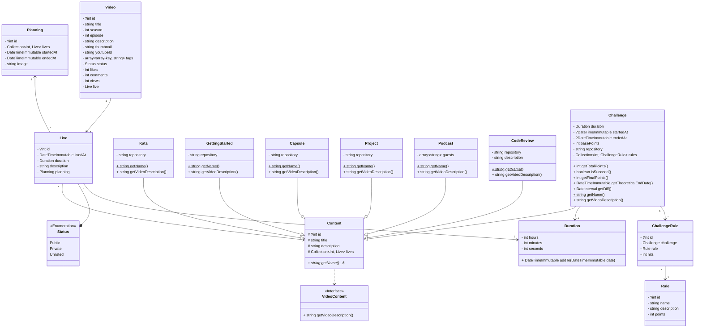

# Twig

## Présentation
Application pour gérer ma création de contenu sur Youtube et surtout Twitch.

## Documentation
Pré-requis :
* PHP 8.1

Installation:
```
make install db_user=root db_password=password db_name=twitch db_host=127.0.0.1 google_api_key=API_KEY google_client_id=CLIENT_ID google_client_secret=CLIENT_SECRET twitter_api_key=API_KEY twitter_api_secret=API_SECRET twitter_token=TOKEN
```

Base de données
```
make prepare env=DEV|TEST
```

Auto correction du code :
```
make fix
```

Analyse du code :
```
make analyse
```

## Diagramme de classes



## Contribuer
Veuillez prendre un moment pour lire le [guide sur la contribution](/CONTRIBUTING.md).

## Changelog
[CHANGELOG.md](/CHANGELOG.md) liste tous les changements effectués lors de chaque release.

## À propos
*twitch* a été conçu initialement par [Thomas Boileau](https://github.com/TBoileau). Si vous avez la moindre question, contactez [Thomas Boileau](mailto:t-boileau@email.com?subject=[Github]%20Twitch)